# GeoServer 教程

## 安装

安装步骤：https://docs.geoserver.org/3.0.x/en/user/installation/war/

1. 安装 Java 17,并配置环境变量

```sh
JAVA_HOME= 安装路径

Path添加
%JAVA_HOME%\bin
```

JDK 17

https://adoptium.net/zh-CN/temurin/releases?version=17

2. 下载Tomcat 11.0.x

https://tomcat.apache.org/download-11.cgi

配置tomcat环境变量

```sh
CATALINA_HOME=tomcat地址
```

给zip的tomcat配置服务

```sh

service.bat install
```

tomcat 11的manager设置登录账号密码
conf/tomcat-users.xml

```xml
<tomcat-users>
<role rolename="manager-gui"/>
<user username="admin" password="YourStrongPassword" roles="manager-gui"/>
</tomcat-users>
```

admin,123456

3. 下载geoserver web服务包

https://geoserver.org/release/stable/

下载Geoserver 3.0.0
https://sourceforge.net/projects/geoserver/files/GeoServer/3.0.0/geoserver-3.0.0-war.zip

将war包放在`Tomcat\webapps`目录下，启动Tomcat的时候会自动解压

4. 访问geoserver

`http://localhost:8080/geoserver`

默认登录账号：用户名 admin，密码 geoserver

## 预览

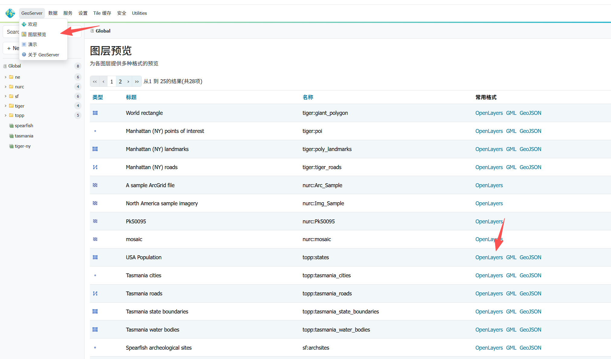

# 发布一个shp文件

参考：https://docs.geoserver.org/3.0.x/en/user/gettingstarted/geopkg-quickstart/

1. 海岸线数据下载数据包

https://www.naturalearthdata.com/downloads/110m-physical-vectors/110m-coastline/

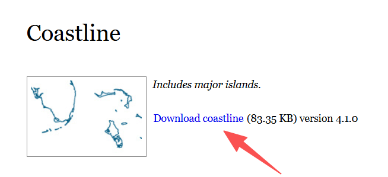

2. 创建数据的工作空间
   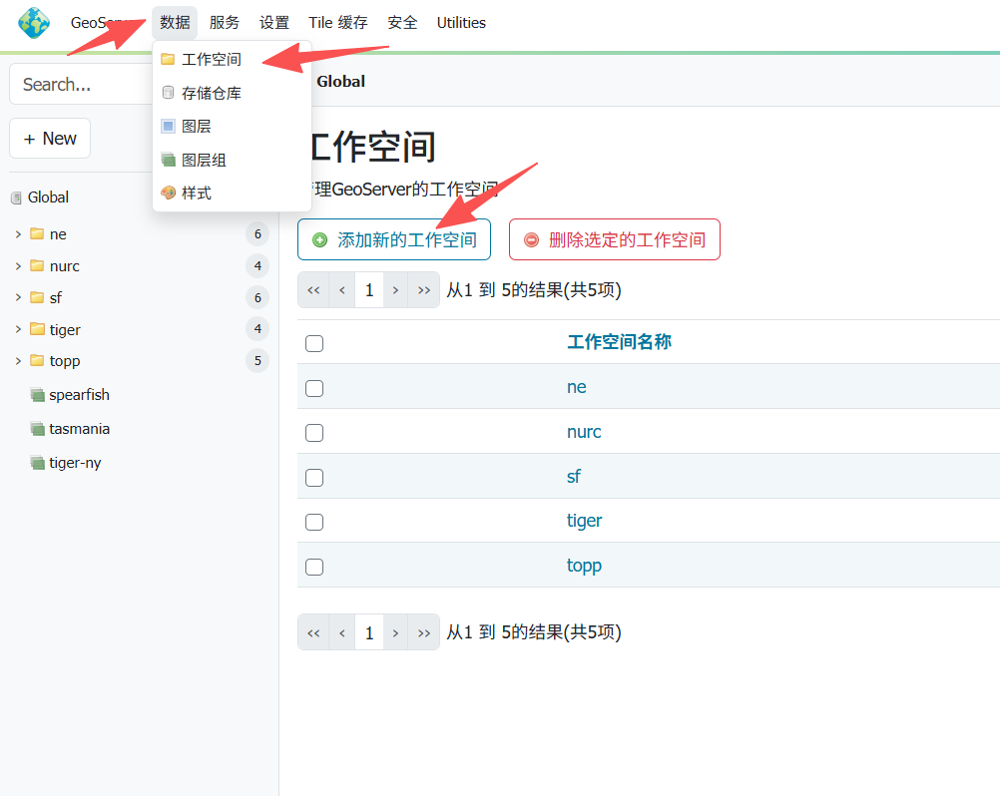

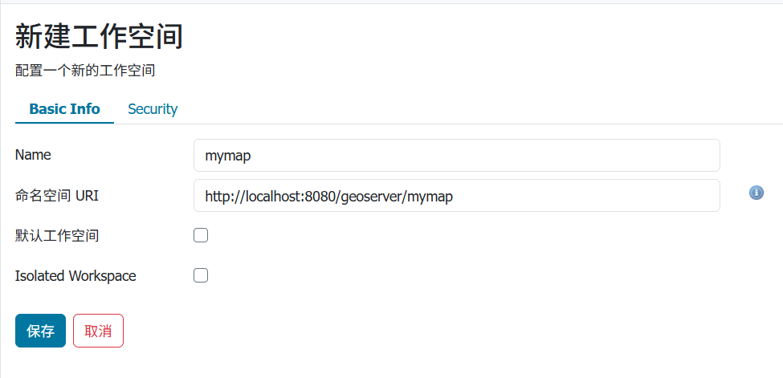

```text
mymap
http://localhost:8080/geoserver/mymap
```

3. 数据的存储仓库里面添加新的存储仓库

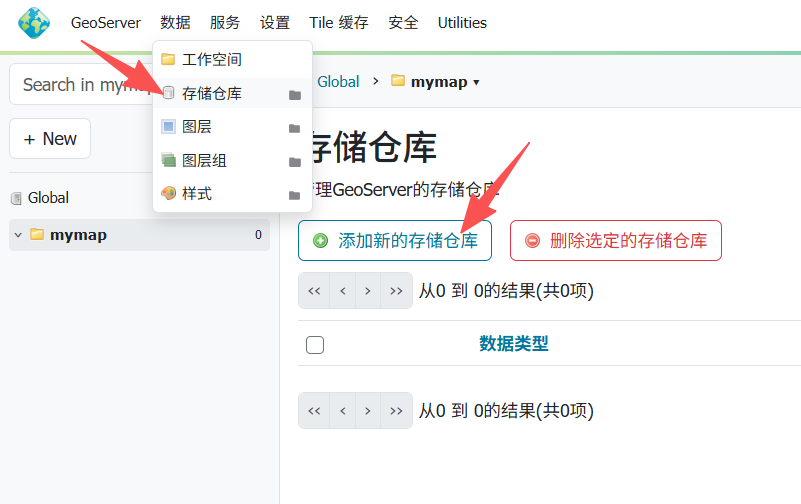

选择shapefile
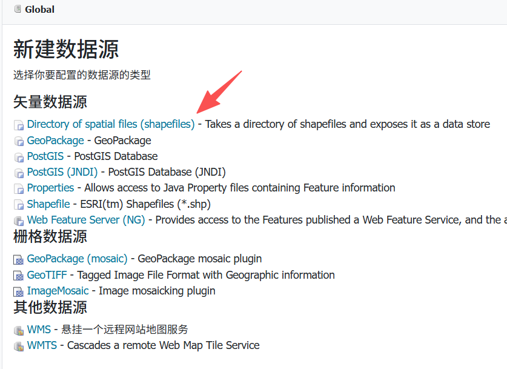

4. 将下载文件的shp文件解压到tomcat的geoserver对应目录下

`apache-tomcat-11.0.24\webapps\geoserver\data\data\mymap`

5. 填写shapefile信息并保存

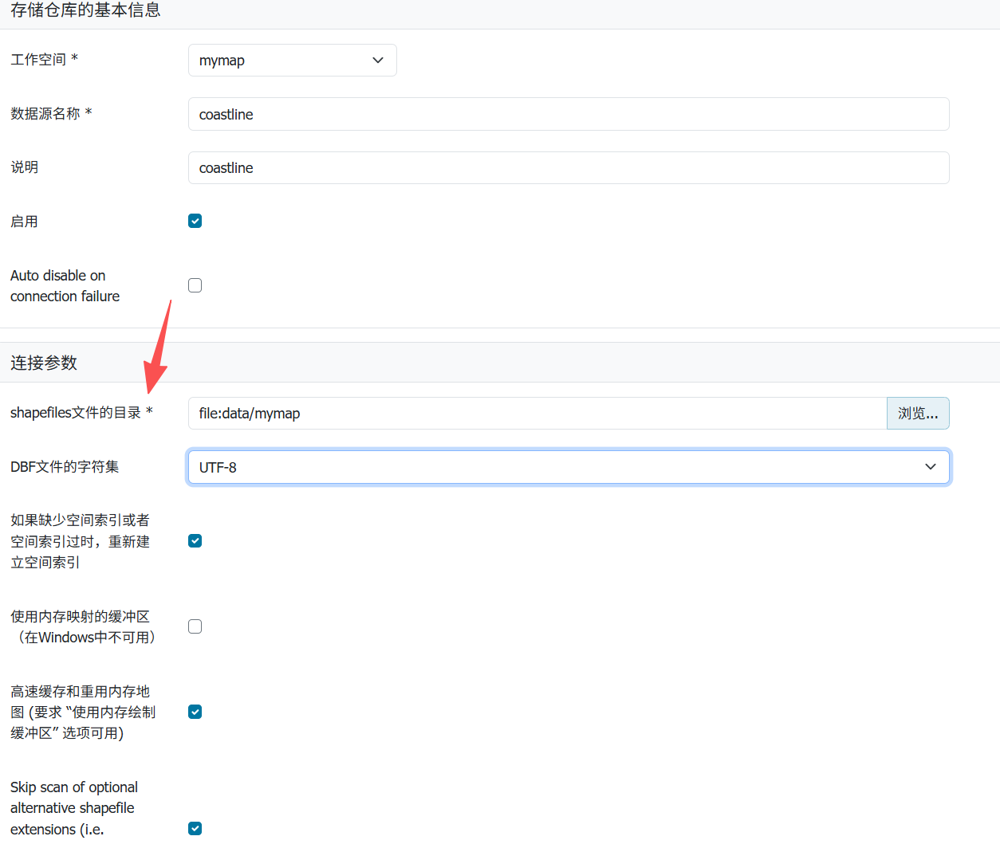

6. 到数据的图层里面添加图层

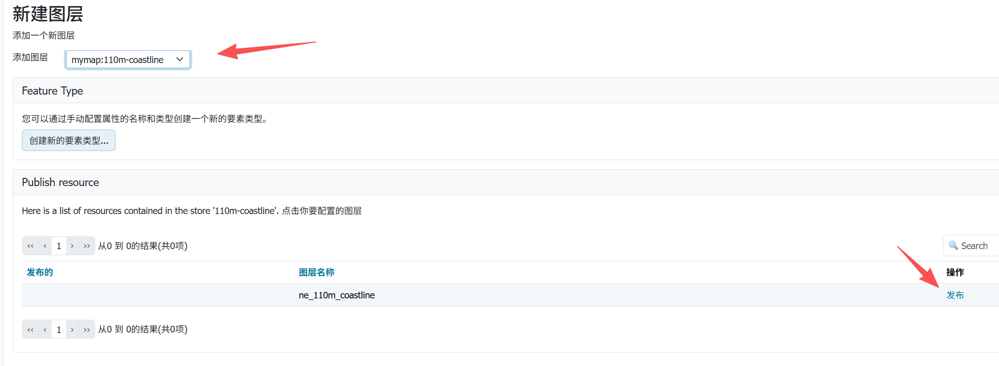

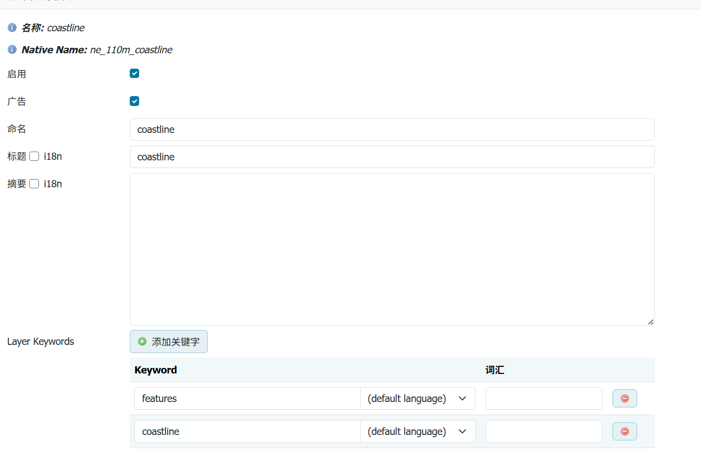

配置坐标系，计算范围

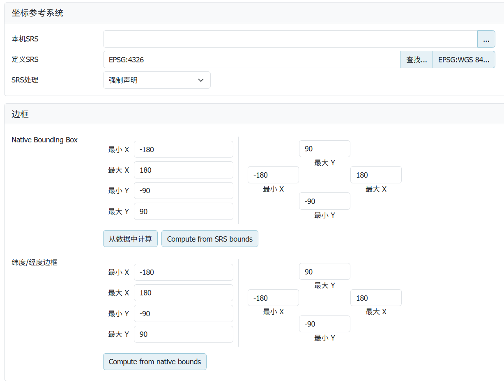

自定义要素类型，多边形

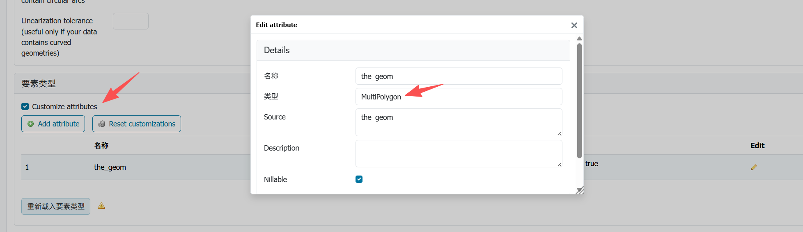

7. 预览刚才添加的图层，有各种预览类型

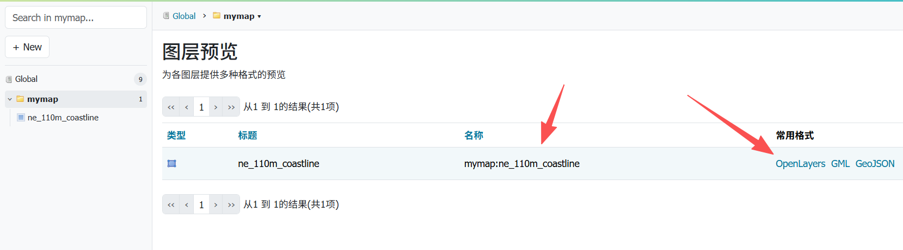

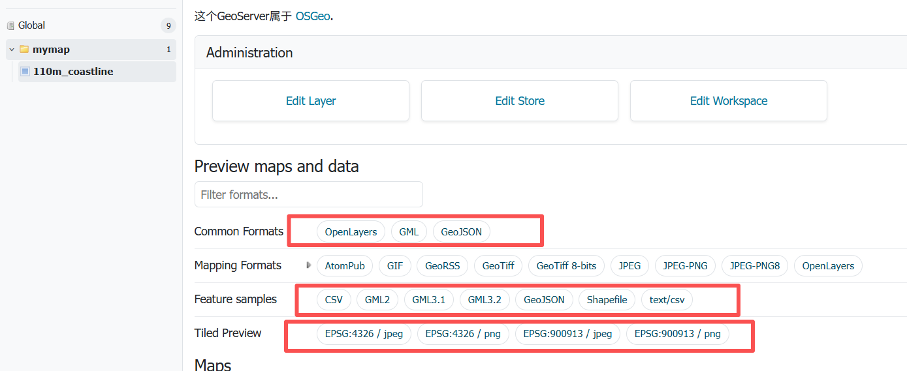

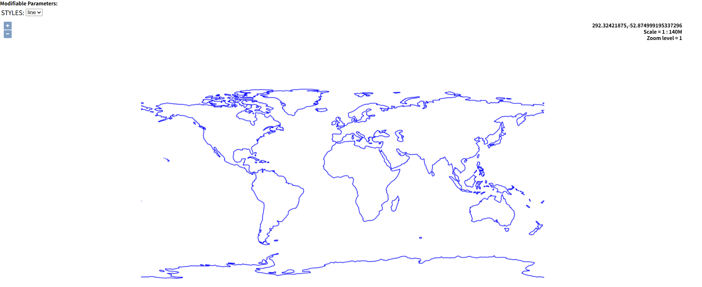

# 新增一个样式

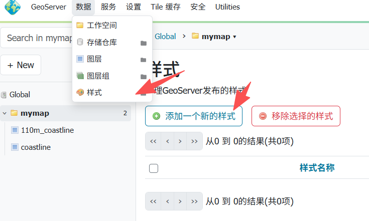

选择形状类型然后生成Generate默认样式，或者选择已有的样式进行复制

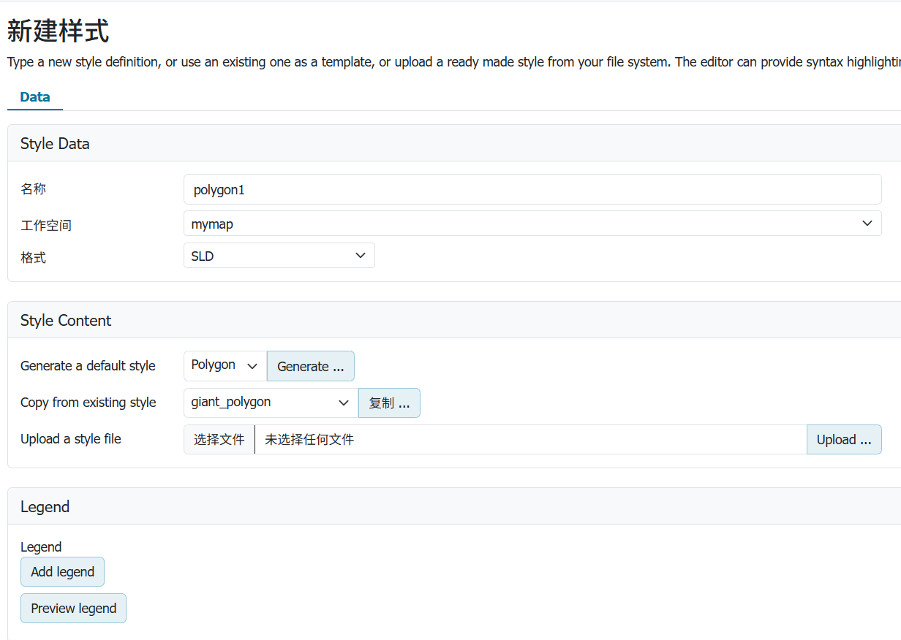

```xml
<?xml version="1.0" encoding="ISO-8859-1"?>
<StyledLayerDescriptor version="1.0.0"
  xsi:schemaLocation="http://www.opengis.net/sld http://schemas.opengis.net/sld/1.0.0/StyledLayerDescriptor.xsd"
  xmlns="http://www.opengis.net/sld" xmlns:ogc="http://www.opengis.net/ogc"
  xmlns:xlink="http://www.w3.org/1999/xlink" xmlns:xsi="http://www.w3.org/2001/XMLSchema-instance">

  <NamedLayer>
    <Name>polygon1</Name>
    <UserStyle>
      <Title>A orange polygon style</Title>
      <FeatureTypeStyle>
        <Rule>
          <Title>orange polygon</Title>
          <PolygonSymbolizer>
            <Fill>
              <CssParameter name="fill">#ffff00
              </CssParameter>
               <CssParameter name="fill-opacity">0.25</CssParameter>
            </Fill>
            <Stroke>
              <CssParameter name="stroke">#0000ff</CssParameter>
              <CssParameter name="stroke-width">1</CssParameter>
            </Stroke>
          </PolygonSymbolizer>
        </Rule>
      </FeatureTypeStyle>
    </UserStyle>
  </NamedLayer>
</StyledLayerDescriptor>
```

勾选已发布的图层并应用样式
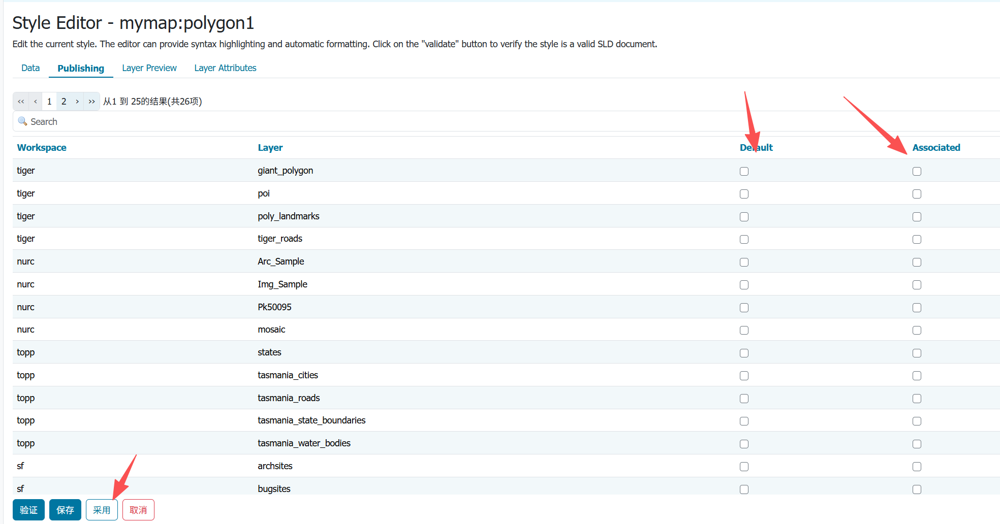

# 发布一个瓦片

https://geoserver.org/release/stable/

在下载界面找到扩展插件Extensions

找到Vector Tiles并下载，将jar包解压到lib文件夹下，重新启动

`apache-tomcat-11.0.24\webapps\geoserver\WEB-INF\lib`

选择之前已发布的图层，点击再次发布，然后先计算范围，然后选择图块缓存

勾选图块图像格式

- application/json;type=geojson
- application/vnd.mapbox-vector-tile
- image/jpeg
- image/png

配置网格集，最大最小缩放等级

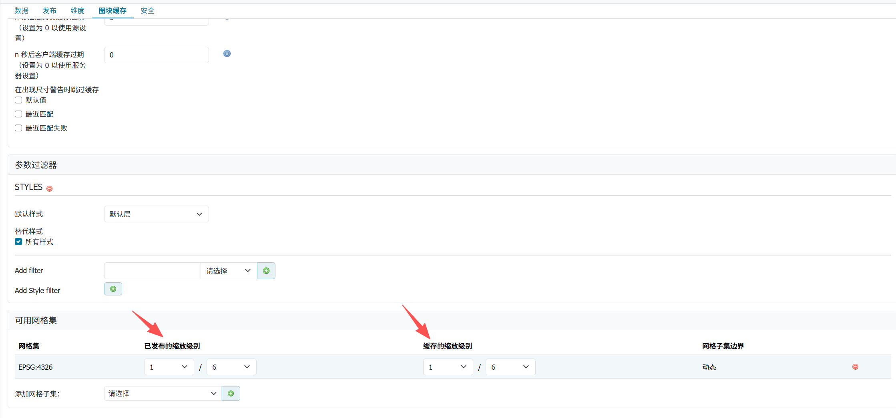

可以访问对应的瓦片

```js
http://<您的GeoServer地址>/geoserver/gwc/service/tms/1.0.0/{workspace}:{layer}@EPSG:{epsg_code}@{format}/{z}/{x}/{y}.{format}

http://localhost:8080/geoserver/gwc/service/tms/1.0.0/mymap:coastline_tiles@EPSG:4326@png/1/1/1.png
```

# postgresql作为 PostGIS数据

postgresql 18
账号：postgres
密码：123456

下载postgis插件
https://download.osgeo.org/postgis/windows/

版本18
https://download.osgeo.org/postgis/windows/pg18/

Navicat右击postgresql数据库，打开命令界面

输入一下代码开启扩展

```sh
CREATE EXTENSION postgis;
```

查看postgis版本

```sh
SELECT PostGIS_Version();
```

创建geojson数据表格

```sql
CREATE TABLE geo_data (
    id SERIAL PRIMARY KEY,          -- 唯一标识符，自动递增
    name VARCHAR(100),              -- 地物名称
    description TEXT,               -- 描述信息
    geom GEOMETRY(Polygon, 4326),   -- 核心空间数据：指定为 Polygon 类型，坐标系为 WGS84 (EPSG:4326)
    properties JSONB,               -- 存储 GeoJSON 中的其他任意属性，JSONB 支持高效查询
    created_at TIMESTAMP DEFAULT NOW() -- 记录创建时间
);
```

插入数据

```sql
INSERT INTO geo_data (name, geom, properties)
VALUES (
    '示例多边形',
    ST_SetSRID(
        ST_GeomFromGeoJSON('{
            "type": "Polygon",
            "coordinates": [
                [[102.0, 0.0], [103.0, 0.0], [103.0, 1.0], [102.0, 1.0], [102.0, 0.0]]
            ]
        }'),
        4326
    ),
    '{"description": "这是一个测试区域"}'::jsonb
);
```

geoserver添加存储仓库为PostGIS，并设置数据库连接
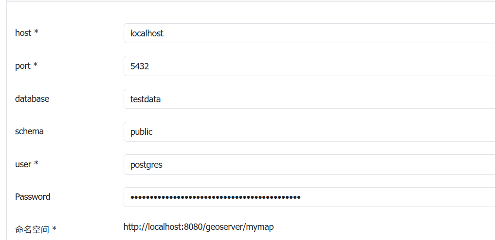

然后创建图层，选择该数据源，然后即可看到其数据库有的geojson表格

# 资源地址

https://www.naturalearthdata.com/downloads/
