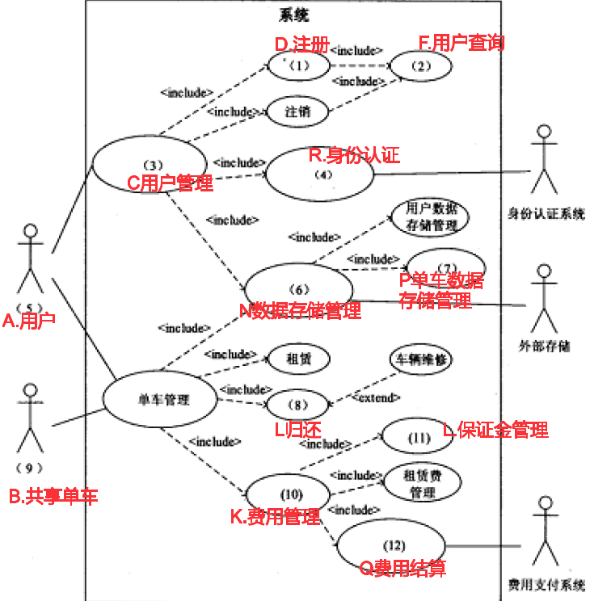

# 试题一

某公司是一家以运动健身器材销售为主营业务的企业，为了扩展销售渠道，解决原销售系统存在的许多问题，公司委托某软件企业开发一套运动健身器材在线销售系统。目前，新系统开发处于问题分析阶段，所分析各项内容如下所述:

- (a)用户需要用键盘输入复杂且存在重复的商品信息;
- (b)订单信息页面自动获取商品信息并填充;
- (c)商品订单需要远程访问库存数据并打印提货单;
- (d)自动生成电子提货单并发送给仓库系统;
- (e)商品编码应与原系统商品编码保持一致;
- (f)商品订单处理速度太慢;
- (g)订单处理的平均时间减少 30%;
- (h)数据编辑服务器CPU性能较低;
- (i)系统运维人员数量不能增加。

【问题1】(8 分)
问题分析阶段主要完成对项目开发的问题、机会和或指示的更全面的理解。请说明系统分析师在问题分析阶段通常需要完成哪四项主要任务。

1. 研究问题领域
2. 分析问题和机会
3. 制定系统改进目标
4. 修改项目计划

【问题2】(9 分)
因果分析是问题分析阶段一项重要技术，可以得出对系统问题的真正理解，并且有助于得到更具有创造性和价值的方案。请将题目中所列(a)~(i)各项内容填入表中(1)~(4)对应位置。

| 因果分析   |            | 系统改进目标 |              |
| ---------- | ---------- | ------------ | ------------ |
| 问题或机会 | 原因和结果 | 系统目标     | 系统约束条件 |
| a,f        | c,h        | b,d,g        | e,i          |

【问题3】(8 分)
系统约束条件可以分为四类，请将类别名称填入表中(1)~(4)对应的位置。

| 约束条件                                   | 类别 |
| ------------------------------------------ | ---- |
| 新系统必须在五月底上线运行                 | 进度 |
| 新系统开发费用不超过20万元                 | 成本 |
| 新系统必须能够实现在线实时处理             | 功能 |
| 新系统必须满足GB31524-2005电商平台技术规范 | 质量 |

# 试题二

某软件公司为共享单车租赁公司开发一套单车租赁服务系统，公司项目组对此待开发项目进行了分析，具体描述如下:

1. 用户(非注册用户)通过手机向租赁服务系统进行注册，成为可租赁共享单车的合法用户，其中包括提供身份、手机号等信息，并支付约定押金；
2. 将采购的共享单车注册到租赁服务系统后方可投入使用。即将单车的标识信息(车辆编号、二维码等)录入到系统；
3. 用户(注册或非注册用户)通过手机查询可获得单车的地理位置信息以便就近取用;
4. 用户(注册用户)通过手机登录到租赁服务系统中，通过扫描二维码或输入车辆编号以进行系统确认，系统后台对指定车辆状态(可用或不可用)，以及用户资格进行确认，通过确认后对车辆下达解锁指令；
5. 用户在用完车辆后关闭车锁，车辆自身将闭锁状态上报到租赁服务系统中，完成车辆状态的更新和用户租赁费用结算；
6. 系统应具备一定的扩容能力，以满足未来市场规模扩张的需要。

项目组李工认为该系统功能相对独立，系统可分解为不同的独立功能模块，适合采用结构化分析与设计方法对系统进行分析与设计。但王工认为，系统可管理的对象明确，而且项目团队具有较强的面向对象系统开发经验，建议采用面向对象分析与设计方法。经项目组讨论，决定采用王工的建议，采用面向对象分析与设计方法开发系统。

【问题1】(7 分)
在系统分析阶段，结构化分析和面向对象分析方法主要分析过程和分析模型均有所区别，请将(a)~(g)各项内容填入表 2-1(1)~(4)处对应位置。

| 系统分析方法     | 主要分析内容 | 分析结构呈现形式 |
| ---------------- | ------------ | ---------------- |
| 结构化分析方法   | d            | b,f              |
| 面向对象分析方法 | a,g          | c,e              |

- (a)确定目标系统概念类;
- (b)实体关系图(ERD);
- (c)用例图;
- (d)通过功能分解方式把系统功能分解到各个模块中;
- (e)交互图;
- (f)数据流图(DFD);
- (g)建立类间交互关系。

【问题2】(12 分)
请分析下面A~Q所列出的共享单车租赁服务系统中的概念类及其方法，在图 2-1 所示用例图(1)~(12)处补充所缺失信息。
A.用户，B.共享单车，C.用户管理，D.注册，E.注销，F.用户查询，G单车管理，H.租
赁，L 归还，J.单车查询，K.费用管理，L.保证金管理，M.租赁费管理，N.数据存储管理，O.用户数据存储管理，P.单车数据存储管理，Q.费用结算，R.身份认证



【问题3】(6 分)
随着共享单车投放量以及用户量的增加会存在系统性能或容量下降问题，请用 200字以内的文字说明，在系统设计之初，如何考虑此类问题?

```
1. 考虑可扩展性问题，利用集群，扩展时采用水平扩展方式。
2. 利用分布式存储方式，将各个城市的数据分散存储，减少压力，提升处理性能。
3. 利用负载均衡技术，解决高并发问题。
```

# 试题三

某软件企业开发一套类似于淘宝网上商城业务的电子商务网站。该系统涉及多种用户角色，包括购物用户，商铺管理员，系统管理员等。
在数据库设计中，该系统数据库的核心关系包括:

- 产品(产品编码,产品名称，产品价格，库存数量，商铺编码)
- 商铺(商铺编码,商铺名称，商铺地址，商铺邮箱，服务电话);
- 用户(用户编码，用户名称,用户地址，联系电话)
- 订单(订单编码，订单日期，用户编码，商铺编码，产品编码,产品数量,订单总价)

不同用户角色也有不同的数据需求，为此该软件企业在基本数据库关系模式的基础上，定制了许多试图。其中，有很多视图涉及到多表关联和聚集函数运算。

【问题1】 (8分)
商铺用户需要实时统计本商铺的货物数运和销售情况，以便及时补货，或者为商铺调整销售策略。为此专门设计了可实时查看当天商铺中货物销售情况和存贷情况的视图，

商铺产品销售情况日报表(商铺编码，产品编码，日销售产品数量，库存数量，日期)。

数据库运行测试过程中，发现针对该视图查询性能比较差，不满足用户需求。
请说明数据库视图的基木概念及其优点，并说明本视图设计导致查询性能较差的原因。

```
视图是虚表，是从一个或几个基本表（或视图）中导出的表，在系统的数据字典中仅存
放了视图的定义，不存放视图对应的数据。
视图的优点：
1、视图能简化用户的操作
2、视图机制可以使用户以不同的方式查询同一数据
3、视图对数据库重构提供了一定程度的逻辑独立性
4、视图可以对机密的数据提供安全保护
查询性能较差的原因是视图中“日销售产品数量”需要针对订单表做统计分析，订单表
中有数量庞大的历史销售记录，所以这种操作极为耗时。
```

【问题2】(8 分)
为解决该枧图查洵性能比较差的问题，张工建议为该数据建立单独的商品当天货物销售、存货情况的关系表。但李工认为张工的方案造成了数据不一致的问题，必须采用一定的手段
来解决。

1. 说明张工方案是否能够对该视图查询性能有所提升，并解释原因:
2. 解释说明李工指出的数据不一致问题产生的原因。

```
1）张工方案能够对该视图查询性能有所提升，因为这样做能极大的减少统计分析的数
据量，对小数据量进行统计，性能是能得以保障的。
2）由于当日订单数据既存储在订单表中，又存储在单独的当天货物销售、存货情况表
中。同一数据存储了两份，一旦出现修改，未同步修改，则会造成数据不一致。
```

【问题3】（9分）
针对李工提出的问题，常见的解决手段有应用程序实现，触发器实现和物化视图实现等。
请用 300字以内的文字解释说明这三种方案。

```
应用程序实现：在进行订单的添加、修改、删除操作时，从应用程序中，控制对两个数
据表都进行相关操作，以保障数据的一致性。
触发器实现：在应用程序中，只对订单表进行操作。但写触发器，当订单表发生变化时，
把当日订单内容同步更新到当天货物销售、存货情况表中。
物化视图实现：建立“当天货物销售、存货情况”的物化视图，物化视图会把相应的数
据物理存储起来，而且在订单表发生变化时，会自动更新。
```
