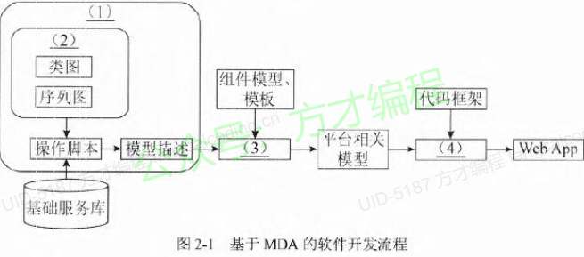
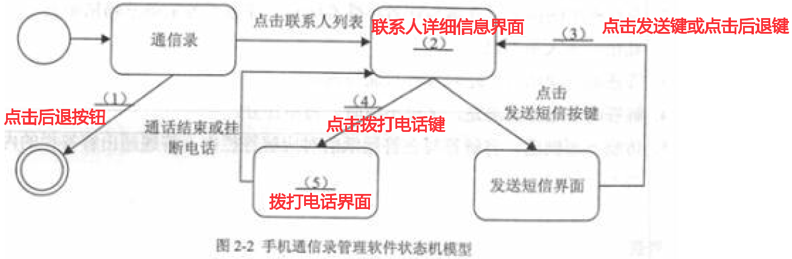
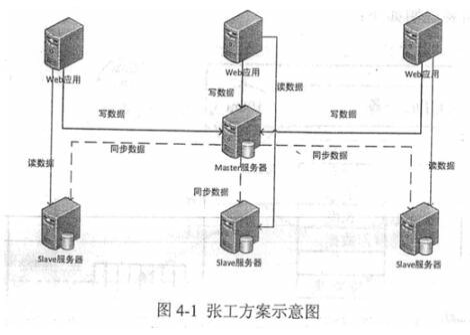
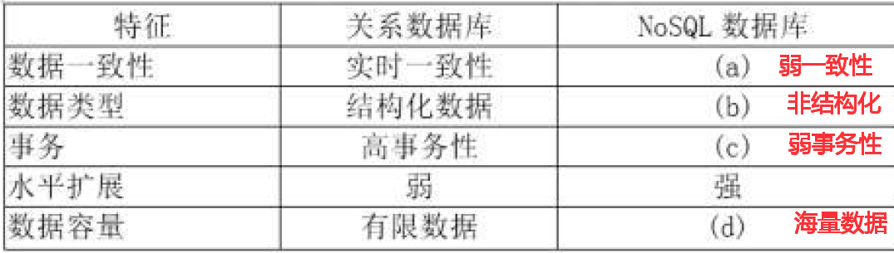
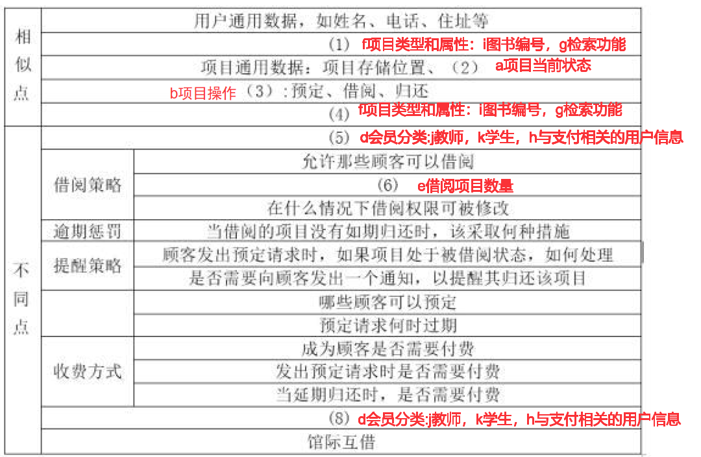

# 试题一

某软件企业为电信公司开发一套网上营业厅系统，以提升服务的质量和效率。项目组经过分析，列出了项目开发过程中的主要任务、持续时间和所依赖的前置任务，如表1-1 所示。在此基础上，绘
制了项目PERT 图。

| 任务名称       | 持续时间（周） | 前置任务 | 松弛时间 |
| -------------- | -------------- | -------- | -------- |
| A.问题分析     | 2              |          |          |
| B.数据建模     | 3              | A        |          |
| C.业务过程建模 | 6              | B        | a:0      |
| D.数据库设计   | 2              | B        | b:3      |
| E.接口设计     | 3              | B,C,D    | c:0      |
| F.程序设计     | 4              | B,D      | d:3      |
| G.单元测试     | 7              | D,E,F    | e:0      |
| H.集成测试     | 2              | G        |          |
| I.安装和维护   | 2              | H        |          |

【问题1】（10 分）
PERT 图采用网络图来描述一个项目的任务网络，不仅可以表达子任务的计划安排，还可以在任务计划执行过程中估计任务完成的情况。针对表1-2 中关于PERT 图中关键路径的描述（1）〜（5），判断対PERT 图的特点描述是否正确，并说明原因。

| 编号 | PERT图特点                         | 是否正确 |
| ---- | ---------------------------------- | -------- |
| 1    | 关键路径是PERT图中工期最长的路径   | 正确     |
| 2    | 一个PERT图仅包含唯一的一条关键路径 | 错误     |
| 3    | 关键路径在项目执行过程中不会变化   | 错误     |
| 4    | PERT图中关键路径越多说明项目越复杂 | 正确     |
| 5    | 关键路径上的任务不能延迟           | 正确     |

【问题2】（5 分）
根据表1-1 所示任务及其各项任务之间的依赖关系，计算对应PERT图中的关键路径及项目所需工期。

关键路径：ABCDGHI
最短工期：25周

【问题3】（10 分）
根据表1-1 所示任务及其各项任务之间的依赖关系，分别计算对应PERT 图中任务C～G 的松弛时间（SlackTime），将答案填入（a）〜（e）中的空白处。

# 试题二

某公司拟开发一套手机通讯录管理软件，实现对手机中联系人的组织与管理。公司系统分析师王工首先进行了需求分析，得到的系统需求列举如下：
用户可通过查询接口查找联系人，软件以列表的方式将耷找到的联系人显示在屏幕上。显示信息包括姓名、照片和电话号码。用户点击手机的“后退”按钮则退出此软件。
点击联系人列表进入联系人详细信息界面，包括姓名、照片、电话号码、电子邮箱、地址和公司等信息。为每个电话号码提供发送短信和拨打电话两个按键实现对应的操作。用户点击手机的“后退”
按钮则回到联系人列表界面。
在联系人详细信息界面点击电话号码对应的发送短信按键则进入发送短信界面。界面包括发送对象信息显示、短信内容输入和发送按键三个功能。用户点击发送按键则发送短信并返回联系人详细信
息界面；点击“后退”按钮则回到联系人详细信息界面。
在联系人详细信息界面内点击电话号码对应的拨打电话按键则进入手机的拨打电话界面。在通话结束或挂断电话后返回联系人详细信息界面。
在系统分析与设计阶段，公司经过内部讨论，一致认为该系统的需求定义明确，建议基于公司现有的软件开发框架，采用新的基于模型驱动架构的软件开发方法，将开发人员从大量的重复工作和技
术细节中解放出来，使之将主要精力集中在具体的功能或者可用性的设计上。公司任命王工为项目技术负责人，负责项目的开发工作。

【问题1】（7 分）
请用300 字以内的文字，从可移植性、平台互操作性、文档和代码的一致性等三个方面说明基于MDA 的软件开发方法的优势。

- 可移植性:在MDA中，先会建立平台无关模型(PIM)，然后转换为平台相关模型(PSM)，1个PIM可转换成多个PSM，所以要把一个软件移植到另一个平台时，只需要将平台无关模型转换成另一个平台的相关模型即可。所以可移植性很强。
- 平台互操作性:在MDA中，整个开发过程都是模型驱动的，所以标准化程度很高，这样为平台的互操作带来了非常大的帮助
- 文档和代码的一致性:在MDA中，代码是由模型生成的，所以具有天然的一致性。这一点其它方法无法比拟。

【问题2】（8 分）
王工经过分析，设计出了一个基于MDA 的软件开发流程，如图2-1 所示。请填写图2-1 中（1）～（4）处的空白，完成开发流程。

- (1)平台无关模型(PIM)
- (2)UML建模
- (3)模型变换(映射)
- (4)模型生成源代码

【问题3】（10 分）
王工经过需求分析，首先建立了该手机通信录管理软件的状态机模型，如图2-2 所示。请对题干需求进行仔细分析，填写图2-2 中的（1）～（5）处空白。

# 试题三

某软件企业开发了一套新闻社交类软件，提供常见的新闻发布、用户关注、用户推荐、新闻点评、新闻推荐、热点新闻等功能，项目采用MySQL 数据库来存储业务数据。系统上线后，随着用户数量的增加，数据库服务器的压力不断加大。为此，该企业设立了专门的工作组来解决此问题。
张工提出对MySQL 数据库进行扩展，采用读写分离，主从复制的策略，好处是程序改动比较小，可以较快完成，后续也可以扩展到MySQL 集群，其方案如图4-1 所示。李工认为该系统的诸多功能，并不需要采用关系数据库，甚至关系数据库限制了功能的实现，应该采用NoSQL 数据库来替代MySQL，重新构造系统的数据层。而刘工认为张工的方案过于保守，对该系统的某些功能，如关注列表、推荐列表、热搜榜单等实现困难，且性能提升不大；而李工的方案又太激进，工作量太大，短期无法完成，应尽量综合二者的优点，采用Key-Value 数据库+MySQL 数据库的混合方案。
经过组内多次讨论，该企业最终决定采用刘工提出的方案。

【问题1】（8 分）

张工方案中采用了读写分离，主从复制策略。其中，读写分离设置物理上不同的主/从服务器，让主服务器负责数据的（a）操作，从服务器负责数据的（b）操作，从而有效减少数据并发操作的（c）,但却帯来了（d）。因此，需要采用主从复制策略保持数据的（e）。

MySQL 数据库中，主从复制是通过binary log 来实现主从服务器的数据同步，MySQL 数据库支持的三种复制类型分别是（f） 、 （g） 、 （h）。
请将答案填入（a）～（h）处的空白，完成上述描述。

- (a)写
- (b)读
- (c)延迟
- (d)数据不一致风险
- (e)一致性
- (f)(g)(h)基于SQL语句的复制(statement-basedreplication, SBR)，基于行的复制(row-based replication, RBR)，混合模式复制(mixed-based replication, MBR)

【问题2】（8 分）
李工方案中给出了关系数据库与NoSQL 数据的比较，如表4-1 所示，以此来说明 该新闻社交类软件更适合采用NoSQL 数据库。请完成表4-1 中的（a） ~ （d）处空白。

【问题3】（9 分）
刘工提出的方案采用了Key-Value 数据库+MySQL 数据库的混合方案，是根据数据的读写特点将数据分别部署到不同的数据库中。但是由于部分数据可能同时存在于两个数据库中，因此存在数据同步问题。请用200 字以内的文字简要说明解决该数据同步问题的三种方法。

1. 通过定时任务机制做定期数据更新。
2. 通过触发器完成数据同步。
3. 通过数据库插件完成数据同步。

# 试题四

某公司因业务需要，拟在短时间内同时完成“小型图书与音像制品借阅系统”和“大学图书馆管理系统”两项基于B/S 的Web 应用系统研发工作。
小型图书与音像制品借阅系统向某所学校的所有学生提供图书与音像制品借阅服务。所有学生无需任何费用即可自动成为会员，每人每次最多可借阅5 本图书和3 个音像制品。图书需在1 个月之内归还，音像制品需在1 周之内归还。如未能如期归还，则取消其借阅其他图书和音像制品的权限，但无需罚款。学生可通过网络查询图书和音像制品的状态，但不支持预定。
大学图书馆管理系统向某所大学的师生提供图书借阅服务。有多个图书存储地点，即多个分馆。
捜索功能应能查询所有的分馆的信息，但所有的分馆都处于同一个校园内，不支持馆际借阅。本科生和研究生一次可借阅16 本书，每本书需在1 个月内归还。教师一次可借阅任意数量的书，每本书需在2 个月内归还，且支持教师预定图书。如预定图书处于被借出状态，系统自动向借阅者发送邮件提醒。借阅期限到达前3 天，向借阅者发送邮件提醒。超出借阅期限1 周，借阅者需缴纳罚款2 元/天。
存在过期未还或罚款待缴纳的借阅者无法再借阅其他图书。图书馆仅向教师和研究生提供杂志借阅服务。
基于上述需求，该公司召开项目研发讨论会。会议上，李工建议开发借阅系统产品线，基于产品线完成这两个Web 应用系统的研发工作。张工同意李工观点，并提出采用 MVP（Model View Presenter）代替MVC 的设计模式研发该产品线。

【问题1】（6 分）
软件产品线是提升软件复用的重要手段，请用300 字以内的文字分别简要描述什么是软件复用和软件产品线。
【问题2】（16 分）
产品约束是软件产品线核心资产开发的重要输入，请从以下已给出的（a）～（k）各项内容，分别选出产品的相似点和不同点填入表5-1 中（1）～（8）处的空白，完成该软件产品线的产品约束分析。
（a）项目当前状态；（b）项目操作；（c）预定策略；（d）会员分类；（e）借阅项目数量；（f）项目的类型和属性；（g）检索功能；（h）与支付相关的用户信息；（i）图书 编号；（j）教师；（k）学生

【问题3】（3 分）
MVP 模式是由MVC 模式派生出的一种设计模式。请说明张工建议借阅系统产品线采用MVP 模式代替MVC 模式的原因。

MVP与MVC相比，最在的差异在于层次之类的耦合度不一样。MVP将M与V彻底分离，所有交互均通过P传达，这样，有利于软件构件及架构的重用，也利于修改，有良好的可扩展性。
