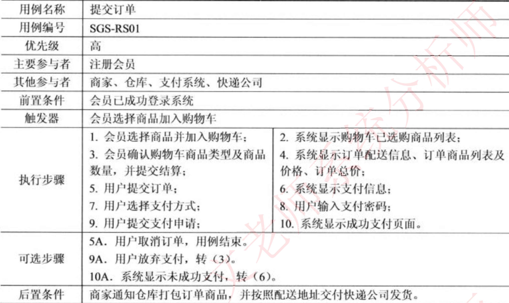
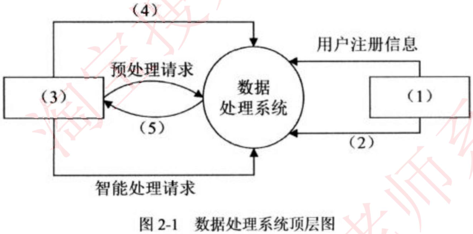
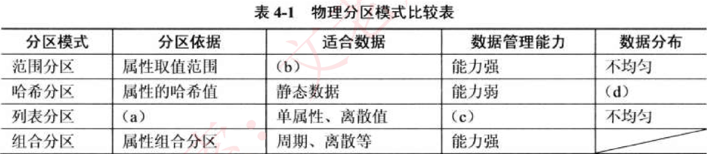
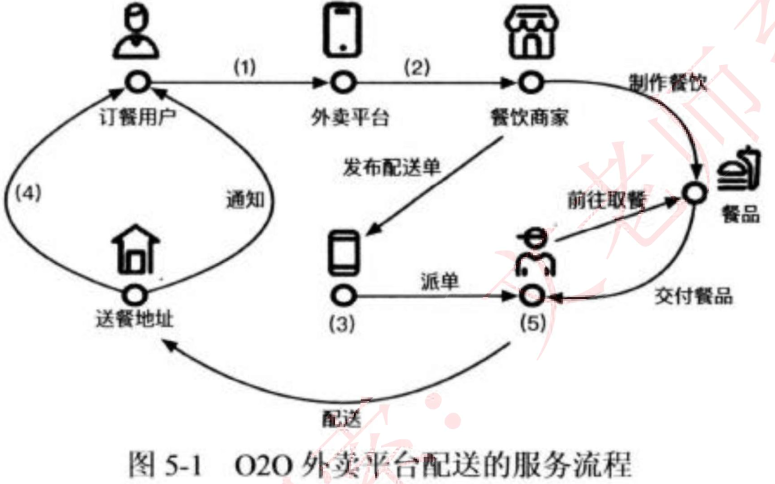
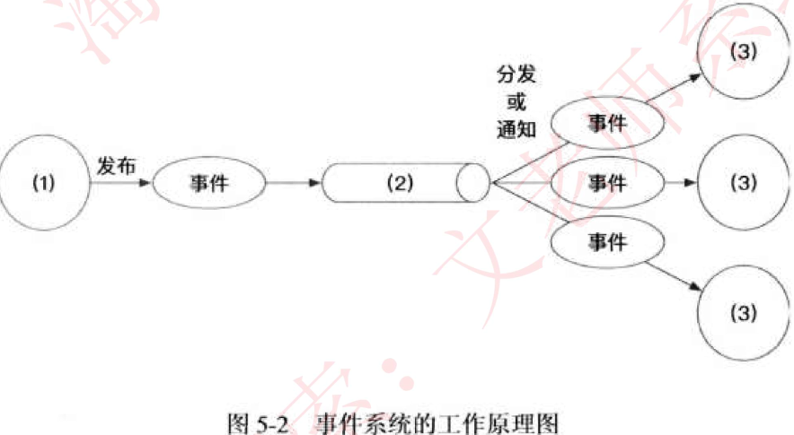

# 试题一

软件企业拟札用面向对象方法开发一套体育用品在线销售系统, 在系统分析阶段 ,“ 提交订单 “用例详细描述如表 1-1 所示。

【问题 1】(9 分)
面向对象系统开发中 ,实体对象、控制对象和接口对象的含义是什么 ?

(1) 实体对象: 用来表示业务域的事实数据并需要持久化存储的对象类型
(2) 控制对象, 用来表示业务系统中应用逻辑和业务规则的对象类型
(3) 接口对象: 用来表示用户与系统之间节互方式的对象类型。

【问题 2】(10 分)

面向对象系统分析与建模中 ,从潜在候选对象中筛选系统业务对象的原则有哪些?

(1) 去除相同含义的对象 ;
(2) 去除不属于系统范围内的对象 ;
(3) “去除没有特定独立行为的对象 ;
(4) 去除含义解释不清楚的对象 ;
(5) “去除属于另一个对象属性或行为的对象。

【问题 3】(6 分)
根据题目所示 “ 提芸订单“用例详细描述 ,可以识别出哪些业务对象?

会员、商品、购物车、订单、配送信息、支付记录。

# 试题二

企业拟开发一套数据处理系统 ,在系统分析阶段 ,系统分析师整理的核心业务流程与需求如下 :
(a) 系统分为管理员和用户两类角色 ,其中管理员主要进行用户注册与权限设置 ,用户主要完成业务功
(b) 系统支持用尸上传多种类型的数据 ,主要包括图像、文本和二维曲线等 ;
(c) 数据上传完成后 ,用户需要对数据进行颂处理操作 , 预处理操作包括图像增强、文本摘要 ,曲线平滑等;
(d) 预处理操作完成后 , 需要进一步对数据进行智能分析 , 智能分析操作包括图像分类、文本情感分析、曲线未来走势预测等 ;
(e) 上述预处理和智能分析操作的中间结果均需要进行保存 :
(f) 用户可以将数据分析结果以图片、文本、二维图表等多种方式进行展示 ,苜支持结果汇总 ,最终导出为符合某种格式的报告。

【问题 1】(9 分)
数据流图 (Data Flow Diagram,DFD) 是一种重要的结构化系统分析方法 ,重点表达系统内数据的传递关系,并通过数据流描述系统功能。请用 300 字以内的文字说明 DFD 在进行系统需求分析过程中的主要作用。

DFD 的主要作用如下 :

(1) DFD 是理解和表达用户需求的工具 ,是需求分析的手段。
(2) DFD 概括地描述了系统的内部逻辑过程 ,是需求分析结果的表达工具 ,也是系统设计的重要参考资料 ,是系统设计的起点。
(3) DFD 作为一个存档的文字材料 ,是进一步修改和充实开发计划的依据。

【问题 2】(10 分)

顶层图(也称作上下文数据流图)是描述系统最高层结构的 DFD, 它的特点是将整个待开发的系统表示为一个加工 , 将所有的外部实体和进出系统的数据流都画在一张图中。请参考题干描述 , 将合适的内容填 (1)~(5) 空白处,完成该系统的顶层图。

(1) 管理员
(2) 用户权限信息
(3) 用户
(4) 多种类型数据
(5) 导出报告/ 展示结果

【问题 3】(6 分 )
在结构化设计方法中 ,通常札用流程图表示某一处理过程 ,这种过程既可以是生产线上的工艺流程也可以是完成一项任务必需的管理过程。而在面向对象的设计方法中 , 则主要采用活动图表示某个用例的工作流程。请用 300 字以内的文字说明流程图和活动图在表达业务流程时的三个主要不同点。

流程图和活动图有如下三个主要区别 :
(1) 流程图着重描述处理过程 , 它的主要控制结构是顺序、分支和循环 ,各个处理过程之间有严格的顺序和时间关系。而活动图描述的是对象活动的顺序关系所遵循的规则 ,它着重表现的是系统的行为 , 而非系统的处理过程。
(2) 流程图只能表达顺序执行过程 , 活动图则可以表达并发执行过程。
(3) 活动图可以有多个结束状态 ,而流程图只能有一个结束状态。

# 试题三

某全国连锁药店企业在新冠肺炎疫情期间，紧急推出在线口罩预约业务系统。该业务系统为普通用户提供口罩商品查询、购买、订单查询等业务，为后台管理人员提供订单查询、订单地点分布汇总、物流调度等功能。该系统核心的关系模式为预约订单信息表。
推出业务系统后，几天内业务迅速增长到每日10万多笔预约订单，系统数据库服务器压力剧增，导致该业务交易响应速度迅速降低，甚至出现部分用户页面无法刷新、预约订单服务无响应的情况。为此，该企业紧急成立技术团队，由张工负责，以期尽快解决该问题。

【问题 1】(9 分)

经过分析 ,张工认为当前预约订单信息表存储了所有订单信息 , 记录已达到了白万级别。系统主要的核心功能均涉及对订单信息表的操作 ,应首先优化预约订单信息表的读写性能 , 建议针对系统中的 SQL 语句 ,建立相应索引 ,并进行适当的索引优化。

针对张工的方案 ,其他设计人员提出了一些异议 ,认为索引过多有很多副作用。请用 100 字以内的文字简要说明索引过多的副作用。

(1) 过多的索引会占用大量的存储空间 ;
(2) 更新开销 ,更新语句会引起相应的索引更新 ;
(3) 过多索引会导致查询优化器需要评估的组合增多 ;
(4） 每个索引都有对应的统计信息 ,索引越多则需要的统计信息越多 ;
(5) 聚集索引的变化会导致非聚集索引的同步变化。

【问题 2】(10 分）

作为团队成员之一 , 李工认为增加索引苜进行优化并不能解决当前问题 ,建议采用物理分区策略 ,可以根据预约订单信息表中“所在城市 “ 属性进行表分区, 并将每个分区分布到独立的物理磁盘上 ,以提高读写性能。常见的物理分区特征如表 4-1 所示。李工建议选择物理分区中的列表分区模式。

请填补表 4-1 中的空 (a）一 (d) 处 ,并用 100 字以内的文字解释说明李工选择该方案的原因。

(a) 属性的离散值
(b) 周期性数据 / 周期数据
(c) 能力强
(d) 均匀

李工建议根据预约订单所在城市进行表分区 ,而所在城市属性为离散值, 根据所在城市属性建工列表
分区 ,也方便不同城市处理目己的数据 ,方便数据管理。

【问题 3】(6 分）
在系统运行过程中, 李工发现后台管理人员执行的订单地址信息汇总等操作 , 经常出现与普通用尸的预约订单操作形成读写冲突, 影响系统的性能.因此李工建议采用读写分离模式 , 采用两台数据库服务器 , 并采用主从复制的方式进行数据同步。请用 100 字以内的文字简要说明主从复制的基本步骤。

主从复制的基本步骤 :
(1) 主服务器将所做修改通过自己的 I/O 线程 , 保存在本地二进制日志中 ;
(2) 从服务器上的 I/O 线程读取主服务器上面的二进制日志 , 然后写入从服务器本地的中继日志;
(3) 从服务器上同时开启一个

SQL thread, 定时检查中继日志 , 如果发现有更新则立即把更新的内容在本机的数据库上面执行一遍。

# 试题四

公司拟开发一个基于 020 (Online To Offline) 外卖配送模式的外卖平台。该外卖平台采用自行建立的配送体系承接餐饮商家配送订单 , 收取费用 , 提供配送服务。餐饮商家在该 020 外卖平台发布配送订单后 , 根据餐饮商家、订餐用户、夕卜卖配送员位置等信息 ,以骑手抢单、平台派单等多种方式为订单找到匹配的外卖配送员 ,完成配送环节 , 形成线上线下的 020 闭环。

基于项目需求 , 该公司多次召开项目研发讨论会。会议上 , 张工分析了 020 外卖平台配送服务的业务流程 , 提出应采用事件系统架构风格实现订单配送 ,芥建议采用基于消息队列的点对点模式的事件派道机制。

【问题 1】(10 分)

基于对 020 外卖平台配送服务的业务流程分析 ,在图 5-1 的空 (1) — (5) 处完善 020 外卖平台配送的服务流程。

(1) 提交订单
(2) 发布订单
(3) 外卖平台
(4) 交付餐品
(5) 配送员

【问题 2】(9 分 )

根据张工的建议 , 该系统采用事件系统架构风格实现订单配送服务。请基于对事件系统架构风格的了解 , 补充图 5-2 的空 （1) — (3) 处 ,完成事件系统的工作原理图。

(1) 事件源
(2) 事件管理器
(3) 事件处理器

【问题 3】 (6 分)
请用 200 字以内的文字说明基于消息队列的点对点模式的定义 ,并简要分析张工建议该系统采用基于消息队列的点对点模式的事件派遣机制的原因。

在基于消息队列的点对点模式中 , 消息生产者生产消息苜发送到消息队列 (Queue) 中 , 然后消息消RAM Queue 中取出并且消费消息。消息被消费以后 ,Queue 中不再有存储 ,所以消息消费者不可能消费到已经被消费的消息 。Queue 支持存在多个消费者 , 但是对一个消息而言 ,只有一个消费者可以消费。
如需求描述 , 任何一个外卖配送订单 (消息）都只能被一个配送员 ( 消费者 ) 接单 ,所 以 ,应该采用基于消息队列的点对点模式。
