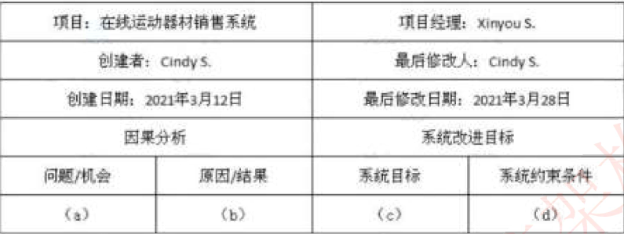
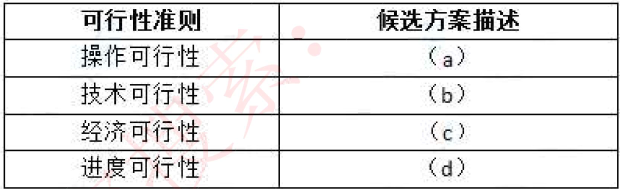
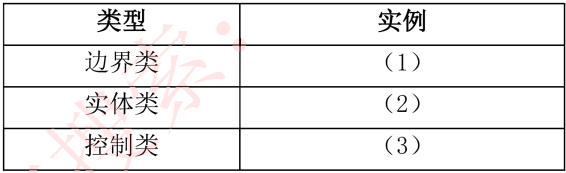
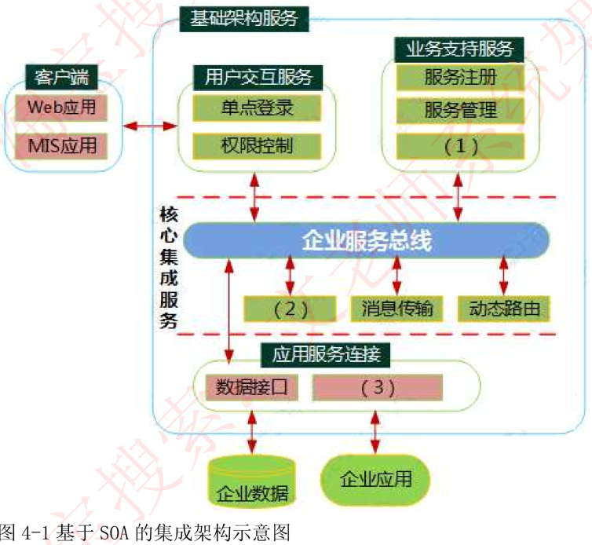

# 试题一

软件企业拟开发一套基于移动互联网的在线运动器材销售系统 , 项目组决定采用 FAST 开发方法进行系统分析与设计 , 在完成了初步的调查研究之后进入了问题分枝阶段, 分析系统中存在的问题以及改进项 , 其分析的主要内容包括 :

(1) 器材销售订单处理的时间应该减少 20%;
(2) 移动端支持 IOS 和 Android 两类操作系统;
(3) 器材销售订单处理速度太慢导致很多用尸取消订单 ;
(4) 后台服务器硬件配置比较低 ;
(5 用户下单过程中应该减少用户输入的数据量 ;
(6) 订单处理过程中用户需要输入大量信息 ;
(7) 利用云计算服务可以降低 50% 的服务器处理时间 :;
(8) 公司能投入的技术维护人员数量有限 ;
(9) 大量的并发访问会导致 App 页面无法正常显示。

【问题 1】(12 分)

FAST 开发方法在系统分析中包括了初始研究、问题分析、需求分机和设策分析等四个阶段 , 请简要说明每个阶段的主要任务。

一、初步研究阶段 : 1. 列出问题和机会 2 协商项目的初步范围 3, 评估项目价值 4. 计划项目进度表和预算 5. 汇报报项目计划

二、问题分析阶段 : 1. 研究问题领域 2. 分析问题和机会 3,分析业务过程 4. 制定系统改进目标 5. 修改顶目计划 6. 汇总调查结果和建议

三、需求分析阶段 : 1. 定义需求 2. 排列需求的优先次序 3. 修改项目计划 4. 交流需求陈述

四、决策分析阶段 : 1. 确定候选方案 2. 分析候选方案 3. 比较候选方案

【问题 2】(8 分)

在问题分析阶段 ,因果分析方法常用于分析系统中的问题和改进项 ,请结合题目中所描述各项内容 , 将题干编号 (1) - (9) 填入表



(a)3
(b)4 6,9
(c)1,5,7
(d)2,8

【问题 3】 (5 分)

在决策分析阶段 ,需要对候选方案所述内容按照操作可行性、技术可行性、经济可行性和进度可行性
进行分类。请将下列 (1) (5) 内容填入表 1-2 的 (a) - (d) 中。
(1) 新开发的器材销售系统能够滢足用户所需的所有功能 ;
(2) 系统开发的成本大约需要 40 万元人民币 ;
(3) 需要对移动端 App 开发工程师进行技术培训 ;
(4) 系统开发周期需要 6 个月 ;
(5) 系统每年维护的费用大约 5 万元人民币。



(a)1 (b)3 (c) 2, 5 (d)4

# 试题二

商校拟开发一套图书馆管理系统 ,在系统分析阶段 ,系统分析师整理的核心业务流程与需求如下 :
系统为每个读者建工一个账户 ,并给读者发放读者证 ( 包含读者证号、读者姓名 ), 账户中存储读者的个人信息、借阅信息以及预订信息等 ,挂有读者证可以借阅图书、返还图书、查询图书信息、预订图书、取消预订等。

在借阅图书时 , 需要输入读者所借阅的图书名、 ISBN 号, 然后输入读者的读者证号, 完成后提交系统 , 以进行读者验证 , 如果读者有效 , 借阅请求被接受 ,系统查询读者所借阅的图书是否存在 ,若存在 , 则读者可借出图书 ,系统记录借阅记录 ; 如果读者所借的图书已被借出 , 读者还可预订该图书。读者如期还书后 ,系统清除借阅记录 ,否则需缴纳罚金 , 读者还可以选择续借图书。同时 ,以上部分操作还需要系统管理员和图书管理员参与。

【问题 1】(6 分)

采用面向对象方法进行软件系统分析与设计时 ,一项重要的工作是进行类的分析与设计。请用 200字以内的文字说明分析类图与设计类图的差异。

- 分析类图主要从业务领域获取信息 , 描述上更多使用了业务领域的语言和词汇。
- 设计类图主要从编程实现角度来设计类图 ,更多考虑类编码的实现。

【问题 2】(11 分)

设计类的首要工作是进行类的识别与分类 , 该工作可分为两个阶段 , 首先,采用识别与筛选法 , 对需求分析文档进行分析 , 保留系统的重要概念与属性 , 删除不正确或元余的内容 ; 其次 , 将识别出来的类按照边界类、实体类和控制类等三种类型进行分类。
请用 200 字以内的文字对边界类 ,实体类和控制类的作用进行简要解释 ,对下面给出的候选项进行识别与筛选 , 将合适的候选项编号填入表 2-1 中的 (1) (3) 空白处 , 完成类的识别与分类工作。


a) 系统管理员
b) 图书管理员
c) 读者
d) 读者证
e）账户
f) 图书
g) 借阅
h) 归还
i) 预订
j) 罚金
k) 续借
l) 借阅记录

(1) d
(2)a,b, c, e, f, j, l
(3) g, h, i, k

【问题 3】(8 分)

根据类之间的相关性特点 ,可以将类之间的关系分为组合 (Ccomposition), 继承 (inheritance), 关联 (association ),聚合 (aggregation) 和依赖 (dependency) 等 5 种 ,请用 300 字以内的文字分别对这 5 种关系的内涵进行叙述 , 苜从封装性、动态组合和创建对象的方便性三个方面对组合和继承关系的优缺点进行比较。

依赖: 一个事物的语义依赖于另一个事物的语义的变化而变化
关联: 是一种结构关系 , 描述了一组链 , 链是对象之间的连接。
继承: 一般 / 特殊的关系 ,孔类和父类之间的关系
组合: 表示类之间的整体与部分的关系 , 且整体与部分的生命周期相同。
聚合: 表示类之间的整体与部分的关系 ,且整体与部分的生命周期可以不同。
封装性： 组合不破坏封装性 ,整体类与局部类之间松耦合 , 相对独工 ; 继承破坏封装性 ,子类与父类紧耦合 ,子类缺独工性。

动态组合: 组合支持动态组合 ; 继承不支持。
创建对象： 组合创建整体类时 ,要创建所有局部类的对象 , 继承创建孔类对象时 ,不需要创建父类对象。

# 试题三

大型企业在长期信息化建设过程中 ,面向不同应用 ,开发了各种不同类型的应用软件系统 ,以满足不同的业务需求 , 随着用户需求和市场的快速变化 ,要求企业应能快速地整合企业的各种业务能力。为不同类型的用户提供多种流程的业务服务。但现有各个独立的应用系统难以满足日益增长和快速变化的用户需求。

目前该企业各个应用系统主要存在以下问题 :
(1) 应用系统是异构的 ,运行在不同软硬件平台上的信息系统。
(2) 应用系统的数据源彼此独立 , 相互封闭, 使得数据难以在系统之间交互 , 共享和融合 , 即存在“信息孤岛 “。
(3) 系统是面向应用的、各个应用系统中的数据模型差异大 , 即使同一数据实体 ,其数据类型、长度均存在不一致甚至相互矛盾的问题 ,为此 , 该企业专门成立了研发团队 ,希望能尼快解决上述问题。

【问题 1】
李工建议采用数据集成的方式来实现数据的整合 ,同时构建新系统来满足新的需求 , 针对题干中的问题 (3), 李工提出首先面向企业核心的业务主题 , 做好企业战略数据规划。建立企业的主题数据库 , 然后再进行集成系统的开发。
请用 200 字以内的文字简要说明主题数据库的设计要求和基本特征 .

```
主题数据库的设计要求:
(1)主题数据库的设计应该能加速应用子系统的开发建设。程序人员可以在综合数据库建立前和整个系统运行前收集子系统开发建设过程中需要的数据，建立主题数据库，这样有利于各应用子系统的并行开发和运行。
(2)主题数据库的设计应尽可能的稳定，能在较长时间内为企业的信息资源提供稳定的服务。
(3)主题数据库的设计应便于整个系统的灵活、高效运行。系统运行后，将一些较稳定、各应用子系统常用的数据存入本机子系统主题库中，子系统对这些数据的请求访问可从主题库中读取，减轻了综合数据库对各子系统的数据请求负担，使子系统与综合数据库间的信息传输量最小化。
(4)主题数据库的设计应使逻辑结构独立于当前的计算机硬件和软件的物理实现过程，能保持在技术不断进步的情况下，主题数据库的逻辑结构仍然有效。

主题数据库具有以下基本特征:
(1)面向业务主题。主题数据库是面向业务主题的数据组织存储。
(2)信息共享。主题数据库是对各个应用系统“自建自用”的数据库的否定，强调建立各个应用系统”共建共用”的共享数据库。不同的应用系统统一调用主题数据库。
(3)一次一处输入系统。圭题数据库要求调研分析企业各经营管理层次上的数据源，强调数据的就地采集，就地处理、使用和存储，以及必要的传输、汇总和集中存储。同一数据必须一次、一处进入系统，保证其准确性、及时性和完整性，单可以多次、多处使用。
(4)由基本表组成。主题数据库是由多个达到基本表规范(满3NF)要求的数据实体构成的。
```

【问题 2 】
张工认为数据集成的方式难以充分利用已有应用系统的业务功能实现不同业务功能的组合 ,建议采用基于 SOA 的应用集成方式将原有系统的功能包装为多个服务 ,给出了基本的集成架构 ,见图:



(1) 业务流程编排 (2) 消息转换 (3) API 或应用程序编程接口

【问题 3】
研发团队在对张工的方案进行分析后 ,发现该方案没有发挥 SOA 的核心理念 , 即松耦合的服务带来业务的复用通过服务的编排助力业务的快速响应和创新、未实现 “ 快速整合企业业务的能力 ,不同类型用户提供各种不同功能 ,不同流程的业务服务的核心目标 ,目前方案仅仅是通过 S0A 实现了系统集成。
请用 200 字以内文字分析该方案未满足本项目核心目标的原因。

张工的方案只是将原有的系统通过 S0A 总线做了简单集成 ,应该把原有的业务功能封装成服务 ,通过服务注册、服务描述、服务发现、标准化接口来调用服务。
