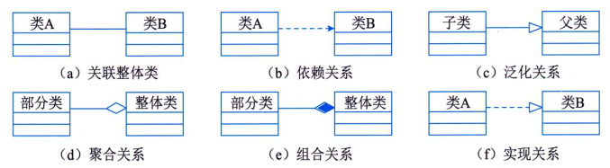

# DFD数据流图

DFD是结构化分析方法中的重要工具，是表达系统内数据流动并通过数据流描述系统功能的一种方法。

主要作用

- DFD是理解和表达用户需求的工具，是需求分析的手段，简明易懂，便于与用户沟通。
- DFD概括描述了系统的内部逻辑过程，是需求分析结果的表达工具，也是系统设计的重要参考资料，是系统设计的起点。
- DFD作为一个存档的文字资料，是进一步修改和充实开发计划的依据。

# ER数据字典

数据字典是DFD的基础上，对DFD中出现的所有命名元素都加以定义，使得每个图像元素的名字都有一个确切的解释。
6类条目：数据元素，数据结构，数据流，数据存储，加工逻辑，外部实体

# STD状态转换图

STD通过描述系统的状态和引起系统状态转换的事件，来表示系统的行为。STD还指出了作为特定时间的结果将执行哪些动作（如处理数据等）

STD既可以表示循环运行过程，也可以表示单程生命期，当描述循环运行过程时，通常不关心循环是怎样启动的，当描述单程生命期是，需要标明初始状态和最终状态。

# 数据流图守恒原则

1. 加工的数据守恒（加工内部平衡）
   - 输入必须被使用：每个加工（处理过程）必须有至少一个输入数据流，且所有输入数据必须参与处理，不能被无故忽略。
   - 输出必须有来源：每个加工的输出数据必须由输入经过加工产生，不能凭空产生数据。
   - 输入输出平衡：加工的输入数据内容必须能从输入数据中通过处理逻辑得到，不能产生与输入无关的数据。
2. 分层数据流图的平衡（父图和子图平衡）
   - 父子图一致性：当加工被分解为下层子图时：
   - 子图的输入输出数据流必须与附图中对应加工的输入输出完全一致（数量和内容）
   - 子图可以展示更详细的数据流和内部加工，单不得改变附图的边界数据流。
   - 避免黑洞，灰洞与奇迹。
   - 黑洞：加工只有输入没有输出，数据无故消失。
   - 奇迹：加工只有输出没有输入，数据凭空产生
   - 灰洞：加工的输出数据无法由输入数据合理推倒，逻辑不完整。
3. 数据存储平衡
   - 数据存储必须通过加工：数据存储只能与加工交互，不能直接与外部实体活其他数据存储交换数据。
   - 读写平衡：对数据存储的读写操作需通过明确的数据流，且必须由加工出发。
4. 外部实体的数据守恒
   - 外部实体不改变数据：外部实体（数据源/终点）仅提供活接收数据，不执行加工。数据流的方向必须明确（流入或流出系统边界）
5. 数据流的一致性
   - 数据流名称一致：同一数据流在各层图中应保持名称一致。
   - 数据流内容明确：数据流应携带明确的数据内容，避免模糊命名。

# UML关系

- 依赖：两个类A和B,如果B的变化可能会引起A的变化，则称类A依赖于类B。
- 关联：关联提供了不同类的对象之间的结构关系，它在一段时间内将多个类的实例连接在一起。关联体现的是对象实例之间的关系，而不表示两个类之间的关系。其余的关系涉及类元自身的描述，而不是他们的实例。
- 泛化：泛化关系描述了一般事物与该事物中的特殊种类之间的关系，也就是父类与子类之间的关系。继承关系是泛化关系的泛关系，子类继承了父类，父类则是子类的泛化。
- 实现：实现关系将说明和实现联系起来，接口是对行为而非实现的说明，而类则包含了实现的结构。一个或多个类可以实现一个接口，而每个类分别实现接口中的操作。
- 组合：表示类之间的整体与部分的关系，部分只能属于一个整体，部分与整体之间的生命周期相同。
- 聚合：表示类之间的整体与部分的关系，部分可能同时属于多个整体，部分与整体的生命周期可以不同。

# 用例关系

- 包含关系:当可以从两个或两个以上的用例中提取公共行为时，应该使用包含关系来表示他们，其中提取出来的公共用例称为抽象用例，而把原始用例称为基本用例或基础用例。
- 扩展关系：如果一个用例明显地混合了两种或两种以上的不同场景，即根据情况可能发生多种分支，则可以将这个用例分为一个基本用例和一个或多个扩展用例，这样使描述可能更加清晰。
- 泛化关系：当多个用例共同拥有一种类似的结构和行为的时候，可以将他们的共性抽象成为父用例，其他的用例作为泛化关系中的子用例。在用例的泛化关系中，子用例是父用例的一种特殊形式，子用例继承了父用例所有的结构、行为和关系。

# 设计类

- 实体类
  实体类映射需求中的每个实体，保存需要存储在永久存储体中的信息，实体类通常是永久性的，他们具有的属性和关系是长期需要的，有时甚至在系统的整个生存期都需要。

- 控制类
  用于控制用例工作的类，一半是由动宾结构的词语（动词+名词，名词+动词）转换而来的名词，如：身份验证对应身份验证器的控制类。控制类用于对一个或几个用例所特有的控制行为进行建模，控制对象（控制类的实例）通常控制其他对象，因此他们的行为具有协调性。
  控制类将用例的特有行为进行封装，控制对象的行为与特定用例的实现密切相关，当系统执行用例的时候，就产生了一个控制对象，控制对象经常在其对应的用例执行完毕后消亡。通常情况下，控制类没有属性，但一定有方法。

- 边界类
  边界类用于封装在用例内、外流动的信息或数据流。边界类位于系统与外界的交接处，包括所有窗体、报表、打印机和扫描仪等硬件的接口，以及与其他系统的接口。

# UML 4+1视图

- 用例视图：需求分析模型，最终用户
- 逻辑视图：展示系统功能，类与对象，系统分析、设计人员
- 实现视图：源代码结构，物理代码文件和组件，程序员
- 进程视图：并发与同步结构，线程、进程、并发，系统集成人员
- 部署视图：软件构建到物理节点映射，软件到硬件的映射，系统和网络工程师

# UML图

- 类图Class Diagram：描述一组类、接口、协作和他们之间的关系。
- 对象图Object Diagram:描述一组对象及他们之间的关系。
- 构件图Component Diagram：描述一个封装的类和她的接口、端口、以及有内嵌的构建和连接件构成的内部结构。
- 组合结构图（Composite Structure Diagram）：描述结构化类（如构件、类）的内部结构，包括结构化类与系统其余部分的交互点。
- 用例图（Use Case Diagram）:描述一组用例、参与者以及他们之间的关系。
- 顺序图（Sequence Diagram）:由一组对象或参与者以及他们之间可能发送的消息构成，强调消息的时间次序。
- 通信图（Communication Diagram）:强调收发消息的对象或参与者的组织结构。
- 定时图Timing Diagram：强调消息跨域不同对象或参与者的实际时间，不仅仅关心消息的相对顺序。
- 状态图（State Diagram）:描述一个状态机，它由状态、转移、事件和活动组成。强调事件导致的对象行为。行为建模
- 活动图Activity Diagram:将进程或其他计算结构展示位计算机内部的控制流和数据流。强调对象建的控制流程。功能建模，业务流程建模
- 部署图Deployment Diagram:描述对运行时的处理节点及在其中生存的构件的配置。
- 制品图Artifact Diagram:描述计算机中一个系统的物理结构。
- 包图Package Diagram:描述由模型本身分解而成的组织单元，以及他们之间的依赖关系。
- 交互概览图Interaction Overview Diagram:活动图和顺序图的混合物

# 面向对象设计原则

继承：白盒复用
组合聚合：黑盒复用

Has-A:聚合或组合
Is-A：继承

1. 开闭原则:指软件实体应对扩展开发， 而对修改关闭，即尽量在不修改原代码的情况下进行扩展。
2. 里氏替换原则：一个软件实体如果使用的是一个基类对象，那么一定使用与其子类对象，而且察觉不出基类对象和子类对象的区别，即把基类对象替换成它的子类。
3. 依赖导致原则：指抽象不改依赖于细节，细节应对依赖于抽象。要针对接口编程而不是针对实现编程。
4. 组合/聚合复用原则：在一个新的对象中通过组合关系或聚合关系来使用一些已有的对象，使之成为新对象的一部分，新对象通过委派调用已有对象的方法达到复用其已有功能的目的。
5. 接口隔离原则：指使用多个专门的接口，而不使用单一的总接口。每个接口应该承担一种相对独立的角色，不多不少，不干不该干的事情，该干的事情都要干。
6. 最少知识原则（迪米特法则）：指一个软件实体应对尽可能少地与其他实体发生相互作用。

# 设计模式（简化）

**创建型**

- 工厂方法(Factory Method)：类的创建型模式，子类决定实例化
- 抽象工厂（Abstract Factory）：对象创建型模式，抽象接口
- 构建器(Builder)：对象创建型模式，类和构建分离
- 原型（Prototype）：对象创建型模式，原型实例复制
- 单例（Singleton）：唯一实例，全局访问

**结构型**

- 适配器（Adapter）模式：类结构型模式，对象结构型模式，转换，兼容接口
- 桥接（Bridge）模式：对象结构型模式，抽象和实现分离
- 组合（Composite）模式：对象结构型模式，整体-部分的树形结构层次
- 装饰（Decorator）模式：对象结构型模式，附加职责
- 外观（Facade）模式：对象结构型模式，对外统一接口
- 享元（Flyweight）模式:对象结构型模式，细粒度，共享
- 代理（Proxy）模式：对象结构型模式，代理控制

**行为型**

- 责任链（Chain of Responsibility）模式：对象行为型模式，传递请求，责任链
- 命令（Command）模式：对象行为型模式，记录请求日志，可撤销
- 解释器（Interpreter）模式：类行为型模式，编译器，虚拟机
- 迭代器（Iterator）模式：对象行为型模式，遍历访问，不暴露内部
- 中介者（Mediator）模式：对象行为型模式，不直接引用
- 备忘录（Memento）模式：保存，恢复
- 观察者（Observer）模式:对象行为型模式，通知改变，自动更新
- 状态（State）模式：对象行为型模式，状态变类
- 策略（Strategy）模式：对象行为型模式，算法替换
- 模板方法（Template Method）模式：类行为型模式，算法框架
- 访问者(Visitor)模式：对象行为型模式，数据与操作分离

# 耦合（从低到高）

无数标控外公内

无数完标枪，遥控在外公室内

- 无直接耦合
- 数据耦合：传递数值
- 标记耦合：传递数据结构
- 控制耦合：控制变量，开关/指令
- 外部耦合：全局值
- 公共耦合：全局结构
- 内容耦合：模块内关联

# 内聚（从高到低）

功顺通过时逻偶
用功夫顺利通过时摞（逻）藕（偶）

- 功能内聚：单一功能，共同作用，缺一不可
- 顺序内聚：顺序执行，输入为输出
- 通信内聚：相同数据结构，相同输入输出
- 过程内聚：按特定次序执行
- 瞬时内聚（时间内聚）：同时执行
- 逻辑内聚：逻辑相似，参数决定
- 偶然内聚（巧合内聚）

# 架构风格

- 数据流体系结构风格：批处理体系结构缝，管道-过滤器体系结构体系
- 调用/返回体系结构风格：主程序/子程序风格，面向对象体系结构风格，层次型体系结构风格，客户端/服务端体系结构风格
- 以数据为中心的体系结构风格：仓库体系结构风格，黑板体系结构风格
- 虚拟机体系结构风格：解释器体系结构风格，规则系统体系结构风格
- 独立构件体系结构风格：进程通信体系结构风格，事件系统体系结构风格
- 面向服务的架构风格

# 黑盒测试

等价类划分法、
边界值分析法、
错误推测法、
因果图法、
判定表驱动法、
正交试验设计法、
功能图法和场景法

# 白盒测试（从弱到强）

(1)语句覆盖：每条语句至少执行一次。
(2)判定覆盖：每个判定的每个分支至少执行一次。
(3)条件覆盖：每个判定的每个条件应取到各种可能的值。
(4)判定/条件覆盖：同时满足判定覆盖条件覆盖。
(5)条件组合覆盖：每个判定中各条件的每一种组合至少出现一次。
(6)修改条件判断覆盖：每一个判断的所有可能结果都出现过、每一个判断中所有条件的所有可能结果都出现过、每一个进入点及结束点都执行过、判断中每一个条件都可以独立影响
判断的结果。

# 香农定理

# 奈奎斯定理

# 信息系统战略规划ISSP

- 第一个阶段主要是以数据处理为核心，围绕职能部门需求进行的信息系统规划，主要的方法包括企业系统规划法、关键成功因素法和战略集合转化法；

- 第二个阶段主要是以企业内部管理信息系统为核心，围绕企业整体需求进行的信息系统规划，主要的方法包括战略数据规划法、信息工程法和战略栅格法；

- 第三个阶段的方法在综合考虑企业内、外环境的情况下，以集成为核心，围绕企业战略需求进行信息系统规划，主要的方法包括价值链分析法和战略一致性模型。
